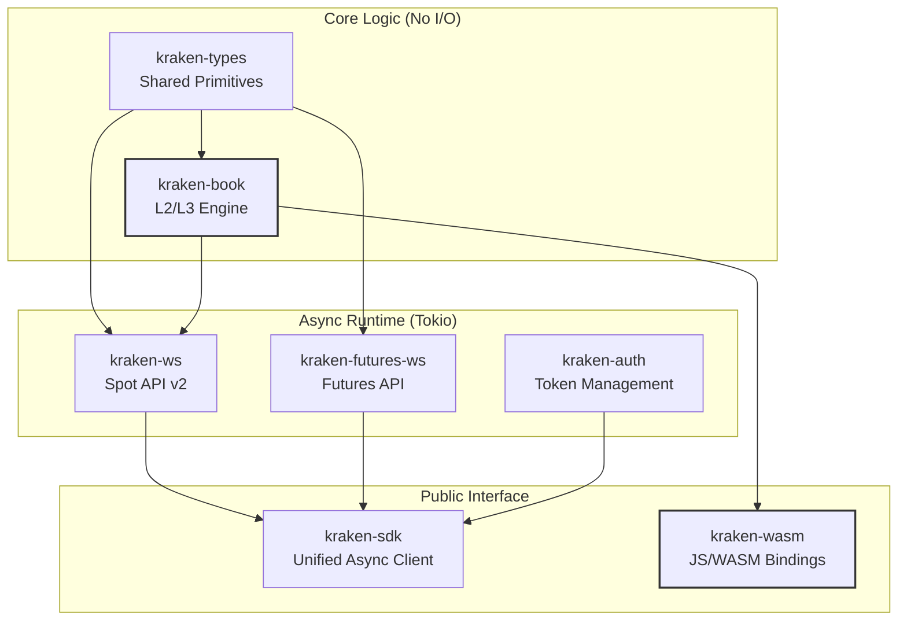
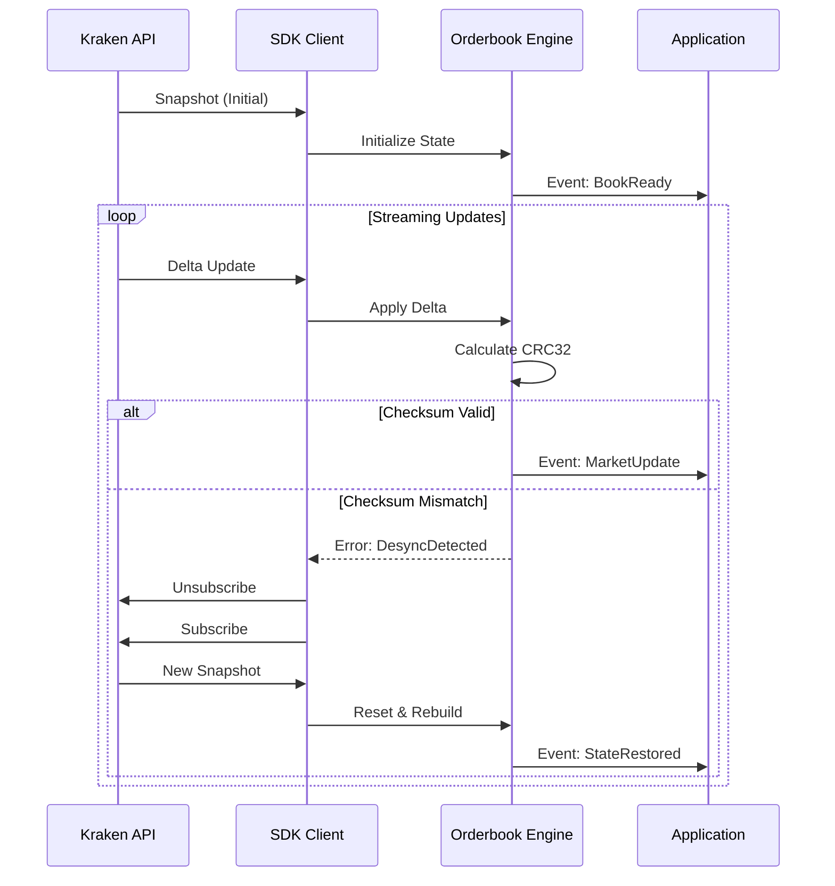
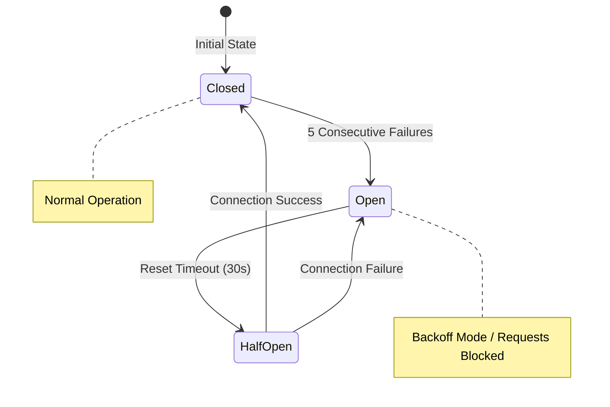

# Havklo SDK

[](https://github.com/hitakshiA/Havklo_sdk/actions)
[](https://opensource.org/licenses/MIT)
[](https://www.rust-lang.org/)

A high-performance, modular Rust SDK for Kraken's WebSocket APIs. Built for institutional-grade algorithmic trading, market making, and real-time data streaming with sub-microsecond orderbook operations.

The architecture decouples core market logic from the networking layer, allowing the orderbook engine (`kraken-book`) to compile to WebAssembly (WASM). This enables the exact same validation logic used in high-frequency backend systems to run with near-native performance in web browsers.

## Live Implementations

The portability of the core engine is demonstrated through the following live applications, all powered by the WASM-compiled `kraken-book` crate running entirely client-side:

| Application | Description | Live Demo | Source Code |
|-------------|-------------|-----------|-------------|
| **Havsyn** | Real-time L2 Orderbook Visualizer | [havsyn.vercel.app](https://havsyn.vercel.app/) | [GitHub](https://github.com/hitakshiA/havsyn) |
| **Havdepth** | Cumulative Depth Charting | [havdepth.vercel.app](https://havdepth.vercel.app/) | [GitHub](https://github.com/hitakshiA/havdepth) |
| **Havflow** | Order Flow Imbalance Analyzer | [havflow.vercel.app](https://havflow.vercel.app/) | [GitHub](https://github.com/hitakshiA/havflow) |
| **Havnet** | Multi-Symbol Dashboard | [havnet.vercel.app](https://havnet.vercel.app/) | [GitHub](https://github.com/hitakshiA/havnet) |
| **Havwatch** | Market Surveillance Tool | — | [GitHub](https://github.com/hitakshiA/havwatch) |

## Features

- **Zero-copy parsing** with sub-microsecond orderbook updates
- **L2 + L3 orderbooks** with queue position tracking
- **CRC32 checksum validation** on every update
- **WebSocket trading** — place, amend, cancel orders without REST
- **Automatic reconnection** with exponential backoff and circuit breaker
- **Browser support** via WebAssembly
- **Financial precision** using `rust_decimal` (no floating point errors)

## Performance Benchmarks

All benchmarks run on Apple M1 Pro using [Criterion.rs](https://github.com/bheisler/criterion.rs). Numbers represent median times.

### Orderbook Operations

| Operation | Latency | Throughput |
|-----------|---------|------------|
| Best bid/ask lookup | 1.0 ns | 1,000,000,000/s |
| Spread calculation | 3.5 ns | 285,000,000/s |
| Mid-price calculation | 22.7 ns | 44,000,000/s |
| Snapshot capture | 81.6 ns | 12,250,000/s |
| Apply delta update | ~100 ns | 10,000,000/s |
| Apply full snapshot (100 levels) | 10.0 µs | 100,000/s |
| Checksum validation | 5.9 µs | 169,000/s |

### Message Parsing

| Operation | Latency | Throughput |
|-----------|---------|------------|
| Parse subscription response | 538 ns | 1,860,000/s |
| Parse orderbook update | 1.1 µs | 920,000/s |
| Parse orderbook snapshot | 2.7 µs | 370,000/s |
| Parse scientific notation | 3.5 µs | 286,000/s |

### L3 Orderbook (Order-Level)

| Operation | Latency | Throughput |
|-----------|---------|------------|
| Best bid/ask | 1.0 ns | 1,000,000,000/s |
| VWAP (1 BTC) | 28 ns | 35,700,000/s |
| VWAP (10 BTC) | 155 ns | 6,450,000/s |
| Add order | ~150 ns | 6,600,000/s |
| Remove order | ~200 ns | 5,000,000/s |
| Queue position | ~30 ns | 33,000,000/s |
| Full snapshot | 23.7 µs | 42,000/s |

*Note: All financial calculations use `rust_decimal` to prevent floating-point errors inherent in standard `f64` representations.*

## Scope & Non-Goals

### In Scope
- Kraken WebSocket API v2 (Spot + Futures)
- Real-time market data streaming
- WebSocket-based order management
- Orderbook state management with validation
- Automatic reconnection and fault tolerance

### Non-Goals
- **REST API**: Use `krakenex` or direct HTTP for REST endpoints
- **Historical data**: This SDK is for real-time streaming only
- **Portfolio management**: No position tracking or P&L calculation
- **Strategy execution**: No built-in trading strategies
- **Cross-exchange**: Kraken only, no unified exchange abstraction

## Quick Start

Add to `Cargo.toml`:

```toml
[dependencies]
kraken-sdk = { git = "https://github.com/hitakshiA/Havklo_sdk" }
tokio = { version = "1", features = ["full"] }
```

Stream BTC/USD orderbook:

```rust
use kraken_sdk::prelude::*;

#[tokio::main]
async fn main() -> Result<(), Box<dyn std::error::Error>> {
    let client = KrakenClient::builder(vec!["BTC/USD".into()])
        .with_depth(Depth::D10)
        .with_book(true)
        .connect()
        .await?;

    // Access real-time market data
    loop {
        tokio::time::sleep(std::time::Duration::from_secs(1)).await;

        if let Some(spread) = client.spread("BTC/USD") {
            println!("BTC/USD spread: {}", spread);
        }

        if let Some(bid) = client.best_bid("BTC/USD") {
            println!("Best bid: {}", bid);
        }
    }
}
```

Process events:

```rust
use kraken_sdk::prelude::*;

#[tokio::main]
async fn main() -> Result<(), Box<dyn std::error::Error>> {
    let client = KrakenClient::builder(vec!["BTC/USD".into()])
        .with_book(true)
        .connect()
        .await?;

    let mut events = client.events();
    while let Some(event) = events.recv().await {
        match event {
            Event::Market(MarketEvent::OrderbookSnapshot { symbol, .. }) => {
                println!("{}: Snapshot received", symbol);
            }
            Event::Market(MarketEvent::OrderbookUpdate { symbol, .. }) => {
                println!("{}: Update received", symbol);
            }
            _ => {}
        }
    }
    Ok(())
}
```

## System Architecture

Havklo utilizes a Rust Workspace to enforce strict separation of concerns. This modularity ensures that heavy asynchronous runtimes (Tokio) are only included where necessary, keeping the core logic crate lightweight, testable, and portable.



### Crate Responsibilities

| Crate | Purpose | WASM |
|-------|---------|------|
| `kraken-sdk` | Unified high-level API | No |
| `kraken-ws` | Spot WebSocket v2 with trading | No |
| `kraken-futures-ws` | Futures perpetuals streaming | No |
| `kraken-auth` | API authentication, token refresh | No |
| `kraken-book` | L2/L3 orderbook engine | Yes |
| `kraken-types` | Core types, error handling | Yes |
| `kraken-wasm` | JavaScript bindings | Yes |

### Dependencies

The SDK is designed with minimal dependencies for each use case:

| Crate | Dependencies | Use Case |
|-------|--------------|----------|
| `kraken-types` | 28 | Shared types only |
| `kraken-book` | 35 | WASM orderbook engine |
| `kraken-sdk` | 268 | Full async SDK |

The full SDK includes async runtime (tokio), networking, and observability. For browser/WASM usage, only `kraken-book` (35 deps) is needed.

## Key Features

### 1. Self-Healing State Engine

The SDK implements a robust state machine that validates data integrity on every update. It utilizes Kraken's CRC32 checksums to detect sequence gaps or data corruption immediately.

- **Automatic Resync:** Upon detecting a checksum mismatch, the SDK transparently handles the unsubscribe/resubscribe lifecycle to fetch a fresh snapshot.
- **Gap Detection:** Sequence numbers are tracked per channel to identify and handle dropped packets.



### 2. Level 3 (L3) Orderbook Support

Unlike standard SDKs that only support aggregated price levels (L2), Havklo includes full support for the Level 3 channel. This enables tracking individual order IDs.

- **Queue Position Analysis:** Estimate fill probability by tracking volume ahead of specific orders.
- **Order Flow Tracking:** Monitor specific large orders as they move through the book.

```rust
use kraken_book::l3::{L3Book, L3Order, L3Side};

let mut book = L3Book::new("BTC/USD", 1000);

// Add individual orders
let order = L3Order::new("order_123", dec!(50000), dec!(1.5));
book.add_order(order, L3Side::Bid);

// Query queue position
if let Some(pos) = book.queue_position("order_123") {
    println!("Position: {} of {} in queue", pos.position, pos.total_orders);
    println!("Volume ahead: {}", pos.volume_ahead);
}

// Aggregate to L2 view
let l2_bids = book.aggregated_bids();
```

### 3. Circuit Breaker Pattern

To prevent cascading failures during API outages or network instability, the connection layer implements a circuit breaker pattern with exponential backoff.



Configuration:
- 5 failures to open
- 30 second reset timeout
- Exponential backoff: 100ms → 200ms → 400ms → ... → 30s max

## Design Decisions

### Financial Precision with `rust_decimal`

Floating point arithmetic causes rounding errors that compound in trading systems. We use `rust_decimal` throughout:

```rust
// This is wrong:
let price: f64 = 0.1 + 0.2;  // = 0.30000000000000004

// We do this:
let price: Decimal = dec!(0.1) + dec!(0.2);  // = 0.3 exactly
```

### Lock-Free Orderbook Access

The orderbook uses `DashMap` for concurrent read access without blocking writers:

```rust
// Multiple threads can read simultaneously
let spread = client.spread("BTC/USD");  // No mutex, no blocking
```

Writers (delta updates) proceed independently. Readers always see a consistent snapshot.

### Zero-Copy Event Handling

Events are delivered via `tokio::sync::mpsc` channels. The connection task writes, your handler reads—no intermediate copies.

### Backpressure & Flow Control

The SDK uses bounded channels to prevent memory exhaustion:

- Event channel: 1024 message buffer (configurable)
- Overflow policy: Newest messages dropped when full
- Detection: `Event::BufferOverflow` emitted when drops occur

```rust
// Monitor for backpressure
match event {
    Event::BufferOverflow { dropped_count } => {
        warn!("Dropped {} messages - handler too slow", dropped_count);
    }
    _ => { /* normal processing */ }
}
```

### WASM Compatibility

`kraken-book` compiles to WebAssembly because:
- No tokio dependency (async is in `kraken-ws`)
- No networking code
- Pure computation with `rust_decimal` and standard collections

## Advanced Features

### WebSocket Trading

Place orders without REST API latency:

```rust
use kraken_ws::trading::{OrderRequest, OrderSide, OrderType};

// Place limit order
let order = OrderRequest::limit("BTC/USD", OrderSide::Buy, dec!(1.0), dec!(50000));
conn.place_order(order);

// Batch operations
conn.cancel_all_orders("BTC/USD");
```

### Automatic Reconnection

Connection drops are handled automatically:

```rust
use kraken_ws::{ConnectionConfig, ReconnectConfig};

let config = ConnectionConfig::new()
    .with_reconnect(ReconnectConfig {
        initial_delay: Duration::from_millis(100),
        max_delay: Duration::from_secs(30),
        multiplier: 2.0,
        max_attempts: None,  // Retry forever
    });
```

### Rate Limiting

Built-in rate limiting prevents API throttling:

```rust
// Automatic rate limiting per Kraken's documented limits
// Public: 1 req/sec
// Private: Based on verification tier
```

### Multi-Symbol Streaming

```rust
let client = KrakenClient::builder(vec![
    "BTC/USD".into(),
    "ETH/USD".into(),
    "SOL/USD".into(),
])
.with_depth(Depth::D25)
.connect()
.await?;

// Each symbol maintains independent orderbook state
for symbol in ["BTC/USD", "ETH/USD", "SOL/USD"] {
    if let Some(spread) = client.spread(symbol) {
        println!("{}: {}", symbol, spread);
    }
}
```

### Enterprise Observability

The SDK exposes observability hooks, allowing integration with external monitoring systems (Prometheus, Datadog, etc.) without modifying internal SDK code.

```rust
let config = ConnectionConfig::new()
    .with_hooks(Hooks::new()
        .on_connect(|info| log::info!("Connected: {:?}", info))
        .on_checksum_mismatch(|info| metrics::increment_counter!("checksum_errors"))
        .on_latency(|micros| metrics::histogram!("processing_time", micros))
    );
```

### Browser Integration (WASM)

```bash
cd crates/kraken-wasm
wasm-pack build --target web
```

```javascript
import init, { WasmOrderbook } from './pkg/kraken_wasm.js';

await init();
const book = new WasmOrderbook("BTC/USD", 10);
book.apply_snapshot(snapshotJson);
console.log("Spread:", book.spread());
```

## Time, Ordering & Semantics

### Timestamp Strategy
- All timestamps from Kraken are preserved as ISO 8601 strings (e.g., `"2024-01-15T10:30:00.123456Z"`)
- The SDK does not normalize or convert timestamps—what Kraken sends is what you receive
- For local timing (reconnect delays, rate limiting), we use `std::time::Instant`
- Connection uptime uses `std::time::Instant` for monotonic measurement

### Ordering Guarantees
- Events within a single WebSocket connection are delivered in wire order
- Orderbook updates for a symbol are sequential—you'll never see update N+1 before N
- After reconnection, you receive a fresh snapshot before any deltas
- Cross-symbol ordering is not guaranteed (BTC update may arrive before ETH even if ETH occurred first)

### Reconnection Semantics
- On reconnect, all active subscriptions are automatically restored
- A `ConnectionEvent::SubscriptionsRestored` event signals when resubscription completes
- Orderbooks are reset and repopulated from fresh snapshots—no stale data carries over
- Your application should treat `SubscriptionsRestored` as "safe to resume processing"

## Examples

All examples connect to live Kraken WebSocket APIs for real market data.

```bash
# Basic ticker streaming
cargo run --example simple_ticker

# L2 orderbook with checksum validation
cargo run --example orderbook_stream

# Multiple symbols monitoring
cargo run --example multi_symbol

# Futures perpetuals (funding rates, mark prices)
cargo run --example futures_stream

# L3 market making simulation
cargo run --example market_maker

# Reconnection with exponential backoff
cargo run --example advanced_reconnect

# Stream API with futures::StreamExt
cargo run --example stream_api

# Observability hooks for monitoring
cargo run --example observability_hooks

# Structured error handling patterns
cargo run --example error_handling

# Graceful shutdown with Ctrl+C
cargo run --example graceful_shutdown

# Full SDK validation against live Kraken
cargo run --example live_validation
```

### Example Coverage

| Example | Features Demonstrated |
|---------|----------------------|
| `simple_ticker` | Basic connection, events, `tokio::select!`, shutdown |
| `orderbook_stream` | L2 orderbook, checksum validation, depth levels |
| `multi_symbol` | Multi-symbol streaming, divergence detection |
| `futures_stream` | Futures WS, perpetuals, funding rates |
| `market_maker` | L3 orderbook, queue position, imbalance, VWAP |
| `advanced_reconnect` | Reconnection config, backoff, circuit breaker |
| `stream_api` | `impl Stream` trait, `StreamExt`, async patterns |
| `observability_hooks` | Hooks API for metrics/logging integration |
| `error_handling` | `KrakenError`, recovery strategies, API error parsing |
| `graceful_shutdown` | Signal handling, clean disconnection |
| `live_validation` | Full SDK validation with real Kraken data |

## Error Handling

All errors implement structured recovery:

```rust
match error {
    KrakenError::RateLimited { retry_after } => {
        // Wait and retry
        tokio::time::sleep(retry_after).await;
    }
    KrakenError::ChecksumMismatch { .. } => {
        // SDK automatically resubscribes
    }
    KrakenError::AuthenticationFailed { .. } => {
        // Refresh credentials
    }
    _ => {}
}

// Or use built-in recovery
if error.is_retryable() {
    let delay = error.retry_after().unwrap_or(Duration::from_secs(1));
    tokio::time::sleep(delay).await;
}
```

## Kraken API Quirks

Behaviors specific to Kraken that may differ from other exchanges:

| Quirk | Description | SDK Handling |
|-------|-------------|--------------|
| Scientific notation | Large/small numbers sent as `"1.5e-8"` | Parsed automatically to `Decimal` |
| Checksum on book | CRC32 checksum with every orderbook message | Validated; mismatch triggers re-snapshot |
| Snapshot before deltas | Always sends full snapshot before streaming updates | SDK waits for snapshot before processing |
| Symbol format | Uses `"BTC/USD"` not `"BTCUSD"` or `"BTC-USD"` | Use exact Kraken format |
| Rate limits vary | Different limits for public vs private, by tier | Built-in rate limiting respects tiers |
| Heartbeat interval | ~30 seconds, connection considered dead after 60s | Auto-detected, triggers reconnect |
| L3 requires approval | Level 3 orderbook needs Kraken account approval | Separate endpoint, documented in examples |
| Futures separate endpoint | Futures uses different WebSocket URL than spot | `kraken-futures-ws` handles this |
| Token expiry | WebSocket tokens expire, need refresh | `kraken-auth` handles auto-refresh |

## API Compatibility

| API | Version | Coverage |
|-----|---------|----------|
| Spot WebSocket | v2 | Full (book, ticker, trade, ohlc) |
| Spot WS Trading | v2 | Full (add, edit, cancel, batch) |
| Futures WebSocket | v1 | Full (all feeds) |
| L3 Orders Channel | v2 | Full |
| REST API | - | Token endpoint only |

## Testing

```bash
# Unit tests
cargo test --workspace

# Integration tests (requires network)
cargo test --workspace -- --ignored

# Benchmarks
cargo bench -p kraken-book

# Live validation (connects to real Kraken)
cargo run --example live_validation
```

## Requirements

- Rust 1.70+
- For WASM: `wasm-pack` and `wasm32-unknown-unknown` target

## License

MIT License. See [LICENSE](LICENSE) for details.

## Author

**Hitakshi Arora**
